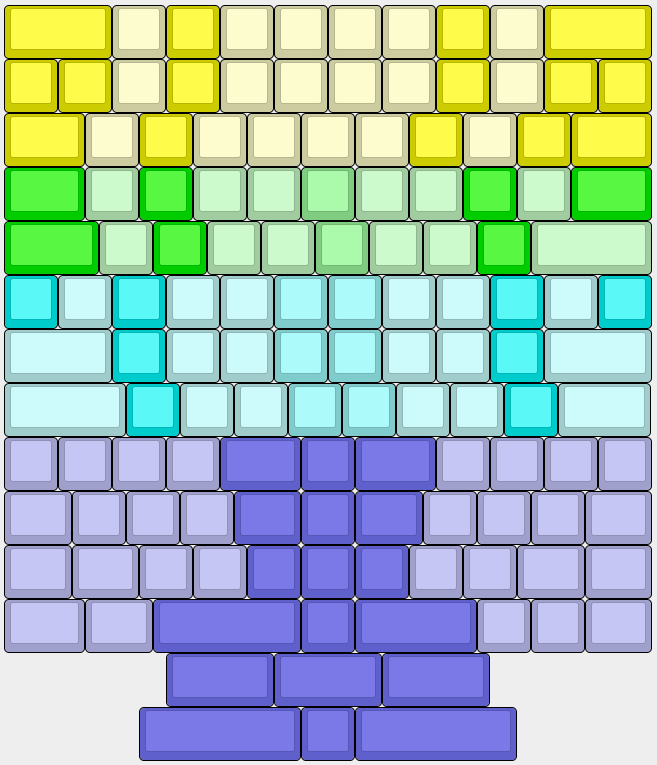

# AtaKi
Wireless universal 40% keyboard in a 12x4U format, including mounting holes for BM40 cases and gaskets.
Will be using ZMK on a nice!nano

The PCB supports multiple configurations, including Katana with 0.5U indent and QAZ, also multiple bottow row configs are possible.
(almost) all switches are mounted sideways to have better stability with the overlapping footprints. Also it's no clearance problem with tested switches/caps and it supports the modified Selectric keycaps (see https://github.com/Tschibo00/qmk/tree/main/hacktrick for details on the idea)

## WARNING
This project is a personal project, i just built one prototype. It's not considered complete, nor tested or error-free.

I won't develop this much, just releasing it as-is for anybody knowledgable picking up and maybe building upon it.

It is NOT ready to take the files and produce a working keyboard!

# Todos
- [x] add PCB artwork
- [x] order the thing
- [ ] hack firmware
- [ ] design Atari 130XE style case including function keys
- [ ] boast about it on r/mk
- [x] fix PCB (esp. encoder mount pads)
- [x] add note to U1 to put nano on bottom side
- [x] add traces to daughter board
- [x] add missing Atari footprints
- [x] move name+link to central bottom row, enlarge a bit
- [ ] move reset switch because it's blocking the usb
