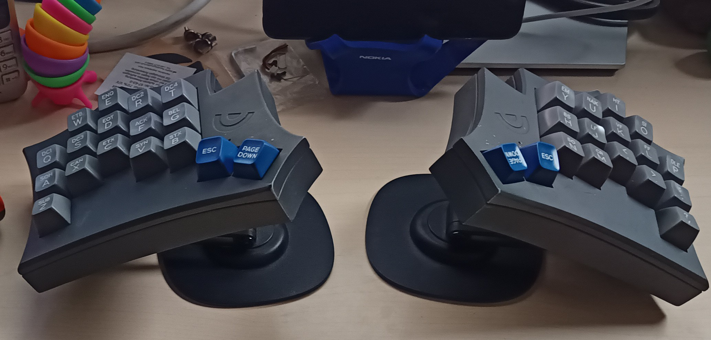

# HackerBrettLe
Wireless split version of my usual keyboard layout, (more or less) migrated to ZMK.

34-key, gasket mount, mag-lock capable, using nice!nano

## WARNING
This project is a personal project, i just built one prototype. It's not considered complete, nor tested or error-free.

I won't develop this much, just releasing it as-is for anybody knowledgable picking up and maybe building upon it.

It is NOT ready to take the files and produce a working keyboard!

# Todos
- [x] fix shifted symbol layer keys
- [x] fix right GUI
- [x] check delay on longer strings (esp. execute-macros)
- [x] check HRM functionality
- [x] check mod-behaviour on thumb keys

